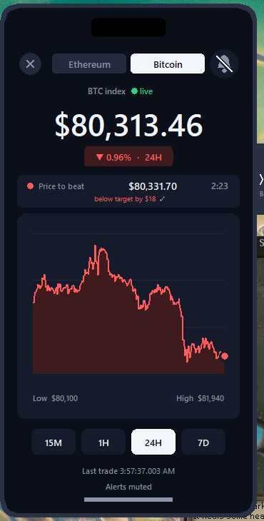

# Asset Cracker

[](https://github.com/DoipSter/asset_cracker/actions/workflows/tests.yml)

A phone-shaped desktop widget for Kalshi's 15-minute crypto prediction markets — the ones
Coinbase Predictions runs on. Live prices, the round's "price to beat", and six paper-trading
strategies competing on real market data.

**Everything is simulated.** No account, no API key, no real orders. It reads public data and
keeps imaginary balances.



## What it does

- **Two pages, one window.** Bitcoin and Ethereum, switched by the buttons at the top. Both keep
  streaming and trading in the background whichever page is showing.
- **Live prices** from Coinbase's WebSocket trade feed (not polling — every trade, as it happens).
- **The 15-minute round**: the price to beat, a countdown, and a chart of the round from open to
  close with a marker for every bet placed, at the price and moment it went in.
- **Two side panels**, one per coin, that slide out from either edge and can both be open at once.
  Each has an Account view, a bet Log, and a Strategies leaderboard.
- **Six strategies**, each with its own $1,000, trading the same live market so you can see which
  approach actually works.

## Does it make money?

No. Over a month of real market data (≈2,900 rounds per coin, Aug–Sep 2026), **every strategy
lost money.** That's the honest headline, and it's why this is a simulator rather than a bot.

What the data shows:

- **Kalshi's prices are well calibrated.** The side that's ahead wins about as often as its price
  implies — 77.9% of the time at an average price of 76.8¢, 95.3% at 95.2¢. There's nothing
  systematically cheap to buy.
- **Fees are the whole story.** Kalshi's fee (7% × price × (1−price) per contract) plus a cent of
  slippage costs roughly 5% of every stake. Beating that needs a real edge.
- **Longshots are overpriced**, not underpriced. Contracts under 5¢ win 1.7% of the time against a
  2.5¢ price; 5–10¢ contracts win 6.1% against 7.4¢. Buying them loses 22–37% of what you stake.
- **The market doesn't lag spot.** Correlation between a model-vs-market disagreement and the
  market's next move is +0.02 — effectively nothing.

The `Lottery` strategy is included deliberately as a **negative result**. It looked like a big
winner in an early backtest until that backtest turned out to have a look-ahead bug: the
volatility window included the next minute's price, so the "volatility spike" was partly detecting
the move that was about to happen. Corrected, it loses like the rest. It's left in, and labelled,
because a documented failed idea is worth more than a quietly deleted one.

## When the price is worth trusting

A separate week-long scrape of five coins — 3,324 settled rounds, tooling in [`research/`](research/) —
turned up the one pattern here that looks structural rather than noise.

**Volume arrives at the end.** 38–48% of a round's entire volume trades in its final minute,
which is exactly the minute the settlement index averages over. BTC 38.3%, DOGE 48.2%.

**And when it does, the price stops being reliable.** Scoring how well the price *three minutes
out* predicted the result (Brier score, lower is better), split by how heavy that last minute was:

| | Calm finish | Heavy finish |
|---|---|---|
| BTC | 0.0205 | 0.1806 |
| ETH | 0.0207 | 0.1401 |
| SOL | 0.0176 | 0.1446 |
| XRP | 0.0196 | 0.1182 |
| DOGE | 0.0194 | 0.1428 |

The innocent reading is reverse causation: close rounds are harder to call *and* attract more late
money. [`research/confound.py`](research/confound.py) tests that by conditioning on what the price
actually said, and the effect survives — it's **largest where the market looked most certain**.
BTC rounds priced 10–25¢ three minutes out scored 0.031 on a calm finish and **0.292** on a heavy
one. Rounds that looked decided, then saw a surge, finished near a coin flip. Same shape on ETH,
SOL and DOGE.

This does **not** prove manipulation. Late information and late price pressure produce an identical
signature, and a directional test on toss-up rounds found no consistent tilt. Cells hold 40–68
rounds. But the practical rule holds either way, and none of the strategies above currently use it:

> A confident price is least trustworthy exactly when the settlement minute is busy.

Two other things worth knowing before building on this market:

- **It's a Bitcoin market.** Weekly volume: BTC 1.64B contracts, ETH 71.8M, XRP 37.3M, SOL 32.7M,
  DOGE 17.6M. BTC carries ~23x ETH and ~93x DOGE. Outcomes are balanced everywhere (UP won
  49.9–51.7%), so there's no directional bias to lean on.
- **The hourly bracket markets are thin.** `KXBTC` lists 188 brackets per hour at $100 wide, but
  only ~10 ever trade and the top 3 hold 80.7% of the hour's volume — 818K for the week against
  1.64B in the 15-minute rounds. `KXBTCD` (hourly above/below) is healthier at 46M.

Full numbers and method in [`research/README.md`](research/README.md).

## The strategies

| Name | Approach |
|---|---|
| `Value` | Blends the model with the market's own odds, one bet, holds to settlement |
| `Model` | Trusts the model more, up to 3 bets per round |
| `Late` | Only bets in the last 2.5 minutes |
| `Scalper` | Up to 25 bets a round, one every 8s, banks gains once a bid has covered 80% of the way to $1 |
| `Favorite` | Backs the favorite late, at 62–88¢ |
| `Lottery` | Cheap longshots after a volatility spike (see above — it loses) |

All of them respect the real rules: Kalshi's fee on every buy and sell, a cent of slippage,
the order book's actual depth, and one net position per market (you can't hold UP and DOWN at
once — buying the other side offsets what you own).

## Running it

```bash
python asset_cracker.py
```

Python 3.8+ on Windows 10/11. No pip packages — standard library and tkinter only.

`make_icon.py` regenerates the app icons and needs Pillow, but you only need it if you want to
change the artwork; the `.ico` files are committed.

## How it works

A few things that took measuring to get right:

**Coinbase's trade feed, not its ticker.** The app subscribes to the `matches` channel over a
hand-rolled WebSocket client (stdlib only). The `ticker` channel carries the same data but
arrives with up to ~150 ms of extra, uneven delay.

**Kalshi's order book, not its market list.** The `/markets` list and even the single-market
endpoint are CDN-cached for several seconds, so their prices go stale — they'd show 54/55 while
the real book had moved to 61. Live quotes come from `/markets/{ticker}/orderbook`, which is real
time. The list is used only to find which round is open.

**Predicting the next round's ticker.** After a round closes, Kalshi's list takes ~30 seconds to
show the next one, but the ticker is derivable from the close time, so the app asks for it
directly and picks it up ~5 seconds after close instead of ~34.

**Self-calibrating the index gap.** Kalshi settles on CF Benchmarks' index (BRTI), which is built
from several exchanges' order books and sits slightly above any single exchange's last trade —
and that gap drifts by a few dollars within minutes, so a fixed constant goes stale. Every settled
round is a free measurement: the settled value *is* the index averaged over that round's final
minute, so comparing it with the app's own average over the same minute gives the gap exactly.
It keeps a median of the last 24 rounds (~6 hours). Measured live, the gap was +0.019% when a
month-old constant said +0.006% — about $10 at $80k.

That last part is also why the headline price won't exactly match any exchange: it's an estimate
of the index, and roughly $8 of round-to-round noise is irreducible.

## Files

| File | |
|---|---|
| `asset_cracker.py` | The app: feeds, window, charts, side panels |
| `kalshi_trader.py` | The trading engine: strategies, fees, accounting, settlement |
| `make_icon.py` | Regenerates `btc.ico` / `eth.ico` (needs Pillow) |
| `tests/` | The suite — `python tests/run.py` |
| `research/` | Scrapes Kalshi markets, tests how they price, backtests the engine — see its own README |
| `CONTRIBUTING.md` | How this repo is worked on: branching, commits, tests |

## Why the Scalper doesn't cut its losses

It looks like it should. It doesn't, and that is a measured decision rather than an
oversight — `research/backtest_stops.py` reproduces all of this.

Over a month of recorded BTC rounds, its money ends up like this:

| How a position ended | n | staked | net |
|---|---|---|---|
| won at settlement | 218 | $1,101 | +$1,776 |
| **lost at settlement** | **713** | **$3,716** | **−$3,716** |
| sold at a profit | 453 | $2,322 | +$1,324 |
| sold at a loss | 45 | $252 | −$126 |

It cuts a loser **45 times out of 758 — 6%.** The code says why: `take_capture` requires
proceeds to beat cost, so it can only fire at a profit, and the value exit fires when the
market is paying *more* than the model thinks the position is worth, which is selling into
strength. Nothing in it sells a position because it is losing.

Adding that turns out to lose money. Both a price stop (`stop_loss`, sell once this much of
the stake is gone) and a time stop (`stop_tau`, sell a position still behind this close to
the bell) are implemented and tested; every setting tried is worse than holding, by $105 to
$207 over the month. Both are off in every shipped strategy, and a test enforces that.

Half the reason is visible in the data: positions that fall below 70% of cost still win
15% of the time, and those wins pay 100¢ on contracts bought for 20¢.

**The other half is a limit of the data, and anyone retrying this needs to know it.** A stop
is only checked when a quote arrives, and the backtest cache is one-minute bars — a whole
minute in which a dying position falls through its floor. A stop aiming to sell at 50% of
cost actually filled at a median of **26%**, with 95% of fills below the floor. Live, the app
quotes every second, so real fills would land much closer. **This backtest cannot fairly test
a price stop.** The time stop can be — the clock never gaps — and it is worse too, which is
the stronger half of the argument.

If you want to settle it on live per-second data, set `stop_tau` or `stop_loss` on the
Scalper in `kalshi_trader.py`. `kalshi_exits.csv` grades every sale with `why = stop` against
what holding would have paid, so a few hundred rounds will answer it properly.

## The anti-world

The left-hand panel holds a mirror of every strategy — `Anti Value`, `Anti Model`,
`Anti Late`, `Anti Scalper`, `Anti Favorite`, `Anti Lottery` — each with its own $1,000 and
the same caps. Twelve accounts, six per world, none shared.

A twin is not a new strategy. It is the same rules fed an inverted belief: wherever the model
says the chance of UP is *p*, its twin is handed *1 − p* and everything follows from there —
which side looks cheap, how big the stake is, when to take a position off. Inverting the
belief rather than just flipping the chosen side matters, because a twin that flipped only
the side would size itself off a conviction it does not hold.

**Why bother.** Every strategy loses money, and there are two explanations that call for
opposite responses. Either the model is systematically *wrong*, in which case inverting it
should pay; or the model is roughly right and the losses are *costs* — the spread plus
Kalshi's fee on every buy and every sell — in which case both sides lose and no amount of
tuning will help. Running the pair separates the two. Nothing else here can.

Over the same month of recorded BTC rounds (`research/backtest_antiworld.py`):

| | P/L | | twin P/L | pair | fees |
|---|---|---|---|---|---|
| Value | −$440 | Anti Value | −$1,000 (bust) | −$1,439 | $1,178 |
| Model | −$998 | Anti Model | −$1,000 (bust) | −$1,998 | $750 |
| Late | −$989 | Anti Late | −$1,000 (bust) | −$1,989 | $350 |
| Scalper | −$742 | Anti Scalper | −$997 | −$1,738 | $405 |
| Favorite | −$969 | Anti Favorite | −$167 | −$1,136 | $100 |
| Lottery | −$568 | Anti Lottery | −$845 | −$1,413 | $227 |

**Both sides lost in six pairs out of six.** The `pair` column is the two P/Ls added
together: if the model carried real information, one side would win more than the other lost
and the pair would be positive. Every pair is negative. That is the market charging for the
privilege of holding an opinion, in either direction — and it says the problem is not that
the model points the wrong way.

## When a strategy runs out

Each strategy starts with **$1,000** and may have at most **$250** at risk across all open
bets at any moment — a quarter of the *starting* bank, not the current one, so a winning run
does not quietly raise the ceiling on its own stakes.

A strategy is finished when it has under a dollar and nothing outstanding: a contract costs a
cent plus fee, so it cannot bet again. Open bets are excluded on purpose — while one is live
the strategy still holds something that might pay, and calling it dead then would flap every
time a round went against it.

Three things happen, in order:

1. **A postmortem is written** to `kalshi_bankrupt_<name>_<time>.md`, before anything is
   cleared. Net by coin, by outcome, by what triggered each early sale, the worst rounds and
   what share of the damage they were, and the exact settings it was running.
2. **A line is appended** to `kalshi_bankruptcies.log` and the app raises a notification.
   That file is tab-separated and append-only, so it can be watched from outside the app.
3. **It is staked again** at $1,000 with a clean log, and `bankruptcies` counts the lives.

Restaking is deliberate. Six strategies exist to be compared, and one sitting at zero stops
producing evidence, so leaving it dead would quietly shrink the experiment. The run that
ended is preserved in its postmortem — and a strategy on its third life is telling you
something a balance alone would not.

## Tests

```bash
python tests/run.py
```

Stdlib `unittest`, no packages to install, and nothing to configure. They run on every push
via GitHub Actions on Windows and Linux across Python 3.12 and 3.13.

They never import `asset_cracker` — that would build a Tk window and fail on a headless
machine — so display logic is checked as geometry and numbers instead. Anything they need
from the app is read out of its source, which means a test notices if the app's own tables
change underneath it.

See [CONTRIBUTING.md](CONTRIBUTING.md) before making changes.

Runtime state (`kalshi_balance*.json`, `kalshi_*.csv`) is gitignored — it's personal
results, and the app recreates it at $1,000 per strategy on first launch.

## The logs, and what to ask them

The app writes three CSVs next to itself while it runs. The trade log says what happened;
the other two exist to say whether it should have.

| File | One row per | Read it to ask |
|---|---|---|
| `kalshi_trades.csv` | bet, sale, settlement | What did it do, at what price, with how long left (`tau`) and what book (`yes_bid`/`yes_ask`)? `why` separates an entry from a value exit from a capture exit. |
| `kalshi_exits.csv` | early sale, written when that round settles | **Did selling early cost us?** `gave_up` is what holding would have paid minus what we got. Positive means the sale was a mistake in hindsight. |
| `kalshi_rounds.csv` | coin per round, *including rounds nobody bet on* | Why didn't it trade? Rows with `bets = 0` are the passed-on rounds. `index_gap_pct` tracks whether the index offset is drifting. |
| `kalshi_bankruptcies.log` | strategy that ran out of money | Which ones die, how long they lasted, and how many times. Tab-separated and append-only, so `tail -f` works. |
| `kalshi_bankrupt_<name>_<time>.md` | the same event, in full | **Why it died.** Net by coin, by outcome, by exit trigger, the worst rounds, and the settings it was running. |

`gave_up` is the number to tune `take_capture` on. Selling early always costs something in
hindsight — a position deep enough in the money to trigger a capture exit usually goes on
to win. The question is whether the reversals it avoids are worth the upside it clips, and
that is a question only a few hundred graded exits can answer. Summing `gave_up` per `why`
and comparing with the realised P/L over the same span is the whole experiment.

A round still open when the app closes is carried across the restart, so restarting does
not punch a hole in the round log.

## Caveats

- Fills assume you get the displayed price plus a cent. On a thin book you'd do worse, so treat
  the balances as a mildly optimistic upper bound.
- Backtests ran at one-minute resolution (Kalshi's historical candles), so they can't test the
  final minute of a round.
- One month of data is one month. It isn't proof of anything either way.
